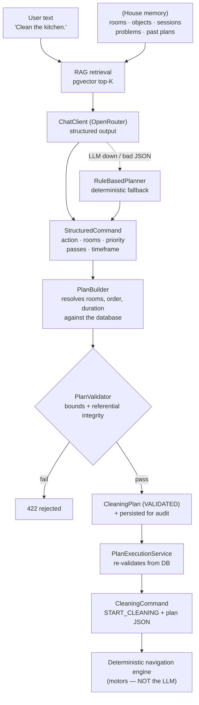
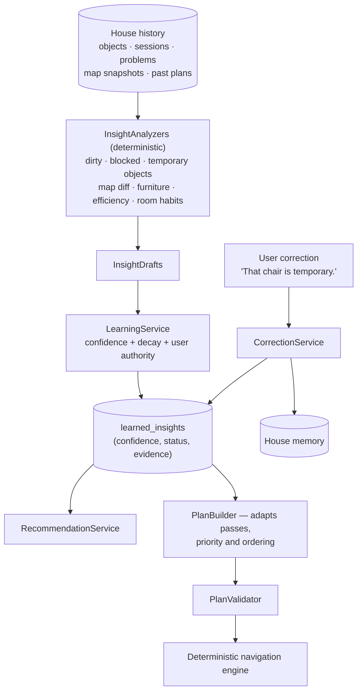
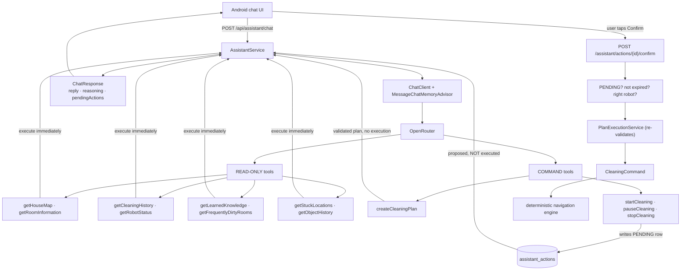

# SwachhBot Backend

Central robot / AI server for the **SwachhBot** floor-cleaning robot. It persists
house knowledge, cleaning history and robot problems, and streams live telemetry
to the Android app.

---

## 1. Project structure

```
SwachhBotBackend/
├── build.gradle                    # Gradle build (Spring Boot 3.4, Java 21)
├── Dockerfile                      # Container definition
├── docker-compose.yml              # Backend + PostgreSQL 16
└── src/main/
    ├── java/com/swachhbot/backend/
    │   ├── SwachhBotBackendApplication.java
    │   ├── ai/                              # AI Planning & Retrieval (Phase 9)
    │   ├── assistant/                       # AI Assistant (Phase 11)
    │   ├── domain/                          # JPA entities
    │   ├── learning/                        # Adaptive Learning (Phase 10)
    │   ├── controller/                      # REST layer
    │   └── websocket/                       # Real-time telemetry
    └── resources/
        ├── application.yml
        └── db/migration/                    # Flyway migrations (V1 to V4)
```


Layer flow: **Controller → Service → Repository → PostgreSQL**.
WebSocket publishing is done by services through `TelemetryPublisher`, so
services never depend on the transport.

---

## 2. Database schema (entity relationships)

```
houses 1───n rooms 1───n furniture
   │
   ├──1───n occupancy_maps          (serialized grid, one latest row per house)
   ├──1───n robot_objects           (remembered objects + lifecycle)
   ├──1───n cleaning_sessions
   └──1───n problem_areas           (frequency-accumulated trouble spots)

robot_state     (1 row per robot_id, latest live state)
cleaning_commands (append-only command log with ack tracking)
```

| Table | Purpose | Key columns |
|---|---|---|
| `houses` | Aggregate root | `id`, `name`, `width`, `height` |
| `rooms` | Named regions | `house_id → houses.id` |
| `furniture` | Sofa/bed/table/… with rotation | `room_id → rooms.id` |
| `occupancy_maps` | Grid string `U/F/O/C`, `version`, `updated_at` | `house_id` |
| `robot_objects` | `type`, `category`, `status`, `x`,`y`, `confidence`, `first/last_detected`, `detection_count` | `house_id` |
| `robot_state` | Live `x`,`y`,`rotation`,`velocity`,`battery`,`status` | `robot_id` (unique) |
| `cleaning_sessions` | `started_at`,`ended_at`,`duration_seconds`,`cleaned_percentage`,`area_cleaned_sqm` | `house_id` |
| `cleaning_commands` | `command`,`status`,`payload`,`issued_at`,`acked_at` | `robot_id` |
| `problem_areas` | `x`,`y`,`radius`,`description`,`frequency`,`last_seen` | `house_id` |

The authoritative DDL lives in
[`V1__init_schema.sql`](src/main/resources/db/migration/V1__init_schema.sql) and is
applied by **Flyway** on startup (`ddl-auto: none`).

---

## 3. Running

### Prerequisites
- **Docker Desktop**
- An [OpenRouter API key](https://openrouter.ai/keys). The default chat and embedding
  models are OpenRouter free models.

### Running with Docker (Recommended)
This starts both the backend and PostgreSQL (with `pgvector`).

```bash
docker compose up --build -d
```

- **Backend:** [http://localhost:8080](http://localhost:8080)
- **Swagger UI:** [http://localhost:8080/swagger-ui.html](http://localhost:8080/swagger-ui.html)
- **Postgres:** `localhost:5433` (on host)

### Manual Run
```bash
./gradlew bootRun
```
Requires a local Postgres with `pgvector` on port 5433.


---

## 4. REST API

Base path: `/api`

| Method | Path | Description |
|---|---|---|
| `GET` | `/houses` | List houses (with rooms + furniture) |
| `GET` | `/houses/{id}` | House detail |
| `POST` | `/houses` | Create house |
| `PUT` | `/houses/{id}` | Update house |
| `DELETE` | `/houses/{id}` | Delete house (cascades) |
| `POST` | `/houses/{houseId}/rooms` | Add room |
| `GET` | `/houses/{houseId}/map` | Latest occupancy map |
| `PUT` | `/houses/{houseId}/map` | Replace map (client pushes grid) |
| `GET` | `/houses/{houseId}/objects` | Remembered objects |
| `PUT` | `/houses/{houseId}/objects` | Upsert object (client-generated id) |
| `DELETE` | `/houses/{houseId}/objects/{objectId}` | Remove object |
| `GET` | `/robots/{robotId}/state` | Live robot state |
| `PUT` | `/robots/{robotId}/state` | Push robot state (**also emits telemetry**) |
| `POST` | `/robots/{robotId}/progress?cleaningPercent=` | Emit progress frame |
| `GET` | `/houses/{houseId}/sessions` | Cleaning history |
| `POST` | `/houses/{houseId}/sessions` | Record a session |
| `GET` | `/commands?robotId=` | Command history for a robot |
| `POST` | `/commands` | Issue a command |
| `POST` | `/commands/{id}/ack` | Acknowledge a command |
| `GET` | `/houses/{houseId}/problems` | Trouble spots (by frequency) |
| `POST` | `/houses/{houseId}/problems` | Report a trouble spot (merges nearby) |

### Example: push robot state

```bash
curl -X PUT http://localhost:8080/api/robots/swachhbot-01/state \
  -H "Content-Type: application/json" \
  -d '{"robotId":"swachhbot-01","x":420,"y":180,"rotation":90,
       "velocity":120,"battery":78.5,"status":"CLEANING"}'
```

---

## 5. WebSocket / realtime

Two transports are registered by
[`WebSocketConfig`](src/main/java/com/swachhbot/backend/config/WebSocketConfig.java):

| Endpoint | Protocol | Consumer |
|---|---|---|
| `/ws/telemetry` | Raw WebSocket (JSON frames) | Android app, future Pi/ROS |
| `/ws/stomp` | STOMP over SockJS (`/topic/...`) | Browser dashboards |

Every `PUT /robots/{robotId}/state` broadcasts a frame to all
`/ws/telemetry` clients:

```json
{
  "type": "telemetry",
  "robotId": "swachhbot-01",
  "x": 420.0, "y": 180.0, "rotation": 90.0, "velocity": 120.0,
  "battery": 78.5, "status": "CLEANING",
  "cleaningPercent": 42.5,
  "timestamp": "2025-01-01T10:15:30Z"
}
```

Send `ping` to receive `pong` (keep-alive).

---

## 6. Android integration

The Android app mirrors these DTOs and talks to the backend via Retrofit +
OkHttp WebSocket. See:

- [`BackendDtos.kt`](../SwachhBot/app/src/main/java/com/example/swachhbot/network/BackendDtos.kt) — DTO mirrors
- [`SwachhBotApi.kt`](../SwachhBot/app/src/main/java/com/example/swachhbot/network/SwachhBotApi.kt) — Retrofit interface
- [`BackendClient.kt`](../SwachhBot/app/src/main/java/com/example/swachhbot/network/BackendClient.kt) — client + telemetry stream
- [`SyncManager.kt`](../SwachhBot/app/src/main/java/com/example/swachhbot/network/SyncManager.kt) — local⇄remote reconciliation

### Minimal usage

```kotlin
val baseUrl = "http://10.0.2.2:8080/" // emulator → host; use the Pi's LAN IP in prod
val client  = BackendClient(baseUrl)
val sync    = SyncManager(repository, client, houseId = "DEMO_HOUSE_01", robotId = "swachhbot-01")

// Push local state up
sync.pushMap(occupancyGrid, gridWidth = 100, gridHeight = 100, cellSize = 10.0)
sync.pushObjects()
sync.pushSession(sessionEntity)
sync.reportProblem(x = 300.0, y = 100.0, radius = 40.0, description = "gets stuck near sofa")

// Live telemetry from the server
client.connectTelemetry { frame ->
    statusText = "${frame.status} · ${frame.battery}%"
}
```

**Sync strategy:** the Android Room database stays the source of truth while
offline; `SyncManager` pushes map/objects/sessions to the backend and pulls
server knowledge back when connectivity returns. Object upserts are keyed by a
client-generated UUID so re-sends are idempotent.

---

## 7. AI planning layer (Phase 9)

Natural-language requests are turned into **validated** cleaning plans by a
Spring AI + pgvector RAG pipeline. **The LLM never controls the motors.**

### Architecture & safety boundary



**Two independent safety gates:**

1. **Schema gate** — the model can only emit `StructuredCommand`, a narrow record
   with categorical/textual fields. There is no field for a motor speed, angle,
   coordinate or delay, so one cannot be expressed.
2. **Validation gate** — `PlanValidator` re-checks every plan (and
   `PlanExecutionService` re-validates from the persisted copy) for bounds
   (passes 1..3, ≤12 rooms, ≤2 h), referential integrity (rooms must exist in the
   house) and exclusion consistency. Client-supplied plans are never trusted.

### Natural language → structured command → plan

| User says | `StructuredCommand` | Resulting `CleaningPlan` |
|---|---|---|
| "Clean the kitchen." | `action=CLEAN, rooms=[KITCHEN]` | clean KITCHEN, 1 pass |
| "Clean the rooms not cleaned in 3 days." | `action=CLEAN_ALL, timeframe="3 days"` | rooms filtered by last-completed-plan timestamp |
| "Don't clean the bedroom." | `action=CLEAN_EXCEPT, excludedRooms=[BEDROOM]` | all rooms except BEDROOM |
| "Clean the dirtiest areas first." | `action=CLEAN_ALL, priority=HIGH` | rooms ordered by nearby problem-area frequency |

### `CleaningPlan` domain model

```java
record CleaningPlan(
    UUID planId, UUID houseId, String naturalLanguage,
    Action action,                 // CLEAN | CLEAN_ALL | CLEAN_EXCEPT
    List<PlannedRoom> rooms,       // ordered, each with priority + rationale
    Priority priority,             // LOW | NORMAL | HIGH | URGENT
    int passes,                    // 1..maxPasses, user-facing only
    List<String> excludedAreas,
    long estimatedDurationSeconds,
    String reason,                 // human-readable justification
    boolean aiGenerated,
    Status status,                 // DRAFT | VALIDATED | REJECTED | EXECUTING | COMPLETED
    Instant createdAt
)
```

### RAG knowledge base (pgvector)

`KnowledgeIngestionService` flattens house memory into natural-language documents
and stores their OpenRouter embedding-model vectors in pgvector:

| Document kind | Example content |
|---|---|
| `HOUSE` | "House 'Home' spans 1000 x 1000 units and has 4 rooms: Living Room, Kitchen…" |
| `ROOM` | "Room 'Kitchen' is at (600, 0) … It contains: refrigerator, table, chair." |
| `OBJECT` | "Object 'sofa' of category PERMANENT has status KNOWN. Last seen at (300, 100)…" |
| `SESSION` | "Cleaning session started … lasted 312 seconds and covered 41.2% of the floor." |
| `PROBLEM` | "Robot problem: gets stuck near sofa near (300, 100). Encountered 5 time(s)…" |

`HouseKnowledgeService` retrieves the top-K most relevant documents (filtered by
`houseId`) and injects them into the prompt, so the model reasons over real facts.

### AI endpoints

| Method | Path | Description |
|---|---|---|
| `POST` | `/api/ai/plan` | `{houseId, request}` → validated plan + explanation |
| `POST` | `/api/ai/plans/{planId}/execute?robotId=` | Re-validate & dispatch as a command |
| `POST` | `/api/ai/plans/{planId}/complete` | Mark the run finished |
| `POST` | `/api/ai/plans/{planId}/reject` | Mark declined |
| `POST` | `/api/ai/knowledge/reindex?houseId=` | Rebuild the pgvector index |

```bash
curl -X POST http://localhost:8080/api/ai/plan \
  -H "Content-Type: application/json" \
  -d '{"houseId":"<uuid>","request":"Clean the rooms that haven not been cleaned in 3 days"}'
```

### Running the AI layer with OpenRouter

```bash
export OPENROUTER_API_KEY="your-openrouter-api-key"
./gradlew bootRun
```

The default models are `meta-llama/llama-3.3-70b-instruct:free` for chat and
`qwen/qwen3-embedding-8b:free` for embeddings. Override either with
`OPENROUTER_CHAT_MODEL` or `OPENROUTER_EMBEDDING_MODEL`. If you select another
embedding model, set `SPRING_AI_VECTORSTORE_PGVECTOR_DIMENSIONS` to its output
dimension before creating the vector-store table.

Set `AI_ENABLED=false` to bypass the LLM entirely — the deterministic
`RuleBasedPlanner` still produces fully validated, executable plans.

---

## 8. Adaptive learning (Phase 10)

The robot learns from its own history and adjusts future plans — without ever
letting the AI near the motors.

### Architecture



**The AI planning layer and the learning layer never move the robot.** Learning
only influences *what* is planned (passes, order, priority); the deterministic
navigation engine still decides everything physical.

### Analyzers (all deterministic, no LLM)

| Analyzer | Detects | Example insight |
|---|---|---|
| `DirtyAreaAnalyzer` | frequently dirty areas | "The Kitchen repeatedly needs extra cleaning (flagged 4 time(s))." |
| `BlockedAreaAnalyzer` | frequently blocked spots | "The robot frequently gets blocked near the Living Room (encountered 5 time(s))." |
| `TemporaryObjectAnalyzer` | objects that keep reappearing | "Chair keeps appearing near the Living Room (seen 4 time(s))." |
| `MapChangeAnalyzer` | current vs previous maps | "Something large has moved near the Kitchen (about 62 grid cells changed)." |
| `EfficiencyAnalyzer` | cleaning efficiency over time | "Cleaning is getting faster: recent runs are 12% quicker." |
| `RoomHabitAnalyzer` | per-room passes + cleanliness | "The Kitchen usually requires 2 passes." / "The Hallway has stayed clean across the last 5 sessions." |

### Confidence model

Confidence follows a saturating curve `e / (e + 3)`, so one observation gives
0.25 and ten give 0.77 — the robot never becomes certain. Status becomes
`CONFIRMED` at 3 observations. Derived insights that stop appearing **decay** and
are eventually forgotten, so the robot can unlearn stale habits.

### User corrections win, permanently

`POST /api/learning/corrections` with
`{"houseId":"...","targetType":"OBJECT","targetKey":"chair","assertion":"That chair is temporary."}`
reclassifies the object in house memory **and** pins the insight as
`USER_CONFIRMED`. A rejection (`USER_REJECTED`) can never be resurrected by the
analyzers.

### API

| Method | Path | Description |
|---|---|---|
| `POST` | `/api/learning/analyze?houseId=` | Re-derive knowledge from history |
| `GET` | `/api/learning/overview?houseId=` | Everything the UI needs (insights + recommendations + changes) |
| `GET` | `/api/learning/insights?houseId=` | Flat insight list |
| `POST` | `/api/learning/corrections` | Apply a human correction |

### Android: "🧠 What the Robot Learned"

[`LearningScreen.kt`](../SwachhBot/app/src/main/java/com/example/swachhbot/ui/LearningScreen.kt)
shows learned objects, learned rooms, problematic areas, cleaning patterns and
recent changes, each with a confidence bar and a status chip. Objects have
**That's temporary / That's permanent** buttons for corrections.


`LearningViewModel` reads the backend and, when it is unreachable, falls back to
deriving insights from the local Room database — so the screen always shows
something useful.

---

## 9. AI assistant with tool calling (Phase 11)

The user can talk to the robot in the Android app. The assistant uses Spring AI
**tool calling**, but the tools it may call are deliberately split into two
classes, and only one of them can change anything.

### Tool-calling architecture



### The three safety properties

| # | Property | How |
|---|---|---|
| 1 | **The model cannot move the robot** | `startCleaning` / `pauseCleaning` / `stopCleaning` only insert a `PENDING` row in `assistant_actions`. They never call `CommandService`. |
| 2 | **A human must authorise** | Only `POST /api/assistant/actions/{id}/confirm` dispatches. It re-checks status, expiry and robot ownership, then routes through the same deterministic execution + re-validation path as everything else. |
| 3 | **The model cannot escape its house** | Tools are instantiated per request with `houseId`/`robotId` bound **by the server**. No tool takes a house id as a parameter, so a prompt-injected model cannot address another house. |

Proposals expire after 10 minutes. A rejected or expired proposal can never run.

### Tools

**Read-only** (safe, execute inline): `getHouseMap`, `getRoomInformation`,
`getCleaningHistory`, `getRobotStatus`, `getLearnedKnowledge`,
`getFrequentlyDirtyRooms`, `getStuckLocations`, `getObjectHistory`.

**Command** (propose-only): `createCleaningPlan` (produces a validated plan, no
execution), `startCleaning`, `pauseCleaning`, `stopCleaning`.

### Reasoning display

`ActionProposalCollector` records **which tools were actually invoked** during the
turn, and the API returns that as `reasoning[]`. The UI shows honest, concrete
lines like *"looked up where I get stuck"* rather than trusting the model to
describe its own thinking.

### Conversation context

`MessageWindowChatMemory` (24 messages) keeps follow-ups coherent, keyed by
`conversationId` via `MessageChatMemoryAdvisor`.

### API

| Method | Path | Description |
|---|---|---|
| `POST` | `/api/assistant/chat` | `{houseId, robotId, conversationId?, message}` → reply + reasoning + pending actions |
| `POST` | `/api/assistant/actions/{id}/confirm?robotId=` | **The only way a proposal becomes a command** |
| `POST` | `/api/assistant/actions/{id}/reject` | Decline |
| `GET` | `/api/assistant/actions?conversationId=` | Outstanding proposals |
| `POST` | `/api/assistant/conversations/{id}/reset` | Forget the conversation |

### Android

[`AssistantScreen.kt`](../SwachhBot/app/src/main/java/com/example/swachhbot/ui/AssistantScreen.kt)
renders the chat: bubbles, a "Checked: …" reasoning list, and **Confirm / Cancel**
cards for anything that would move the robot. Reachable from the simulator header
via **🤖 Ask**.


## 10. ROS 2 Integration (Phase 21)

SwachhBot supports **ROS 2** (Humble/Iron) on a Raspberry Pi. The architecture
separates the high-level intelligence (Spring Boot) from the low-level robotics
(ROS 2).

### Topic Mapping

| ROS 2 Topic | Type | SwachhBot Concept |
|---|---|---|
| `/cmd_vel` | `geometry_msgs/Twist` | Raw motion control |
| `/odom` | `nav_msgs/Odometry` | Localization source |
| `/goal_pose` | `geometry_msgs/PoseStamped` | Nav2 autonomous goal |
| `/map` | `nav_msgs/OccupancyGrid` | SLAM output |

### Deployment on Raspberry Pi

1. **Install ROS 2** on your Raspberry Pi.
2. **Install rosbridge-suite**: `sudo apt install ros-humble-rosbridge-suite`.
3. **Launch the bridge**: `ros2 launch rosbridge_server rosbridge_websocket_launch.xml`.
4. **Set mode**: In `application.yml`, set `swachhbot.robot.mode=ros2` and `ros-bridge-url` to your Pi's IP.

---

## 11. Known Limitations

The API is already hardware-agnostic — a robot is just a `robotId` that pushes
`/robots/{id}/state` and listens on `/ws/telemetry`:

1. **Pi as a client** — a small Python/C++ node POSTs state and subscribes to the
   telemetry socket, exactly like the Android simulator does today.
2. **ROS bridge** — a `rosbridge` node can translate `/ws/telemetry` frames into
   ROS topics and feed `geometry_msgs/Twist` commands from `POST /commands`.
3. **Command channel** — `GO_TO`/`RETURN_TO_DOCK` carry a JSON `payload` for
   waypoints, so no schema change is needed when real navigation arrives.

The Spring AI planning layer (section 7) already consumes these repositories for
RAG, so ROS integration only needs to feed telemetry in and accept the existing
high-level `START_CLEANING` commands — no changes to the AI or data layers.
